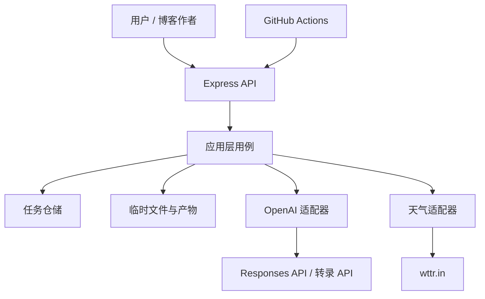

# OpenAI 多模态博客助手：工程架构设计文档

> 文档版本：v1.0 ｜ 适用阶段：从第 3、4 章示例工程整合为可部署的学习研究型 HTTP 服务 ｜ 最后更新：2026-08-11

## 1. 目标、范围与边界

### 1.1 目标

将已完成的音频转录、文本摘要、天气工具调用和 Express 示例整合为一个可维护、可测试、可观测的服务：用户上传音频后获得任务标识；服务完成转录与摘要并保存产物；用户可查询任务与下载文本；天气能力作为独立外部工具供助手调用。系统同时提供健康检查、统一错误处理、最小可行 CI 和关键过程记录。

### 1.2 本期范围

| 包含（本期） | 暂缓（可能之后做） |
| --- | --- |
| 音频文件校验、临时存储、异步处理、转录、摘要、结果查询/下载 | 本地 Whisper 模型（约 2GB，作为独立可选实现；依赖模型下载与资源评估，通过同一转录端口接入） |
| Responses API 工具调用与 wttr.in 天气适配 | — |
| OpenAPI、单元/集成/E2E 测试、GitHub Actions CI | — |
| 结构化日志、请求 ID、指标端点、运维记录 | — |

> **范围外（永久非目标）**：账户、付费、多租户、长期对象存储、数据库集群——本项目定位为开源的学习研究及非商业应用，不计划引入。

> **部署边界（本期）**：仅本地/演示部署（单机），提供 CI 与健康监测；不承诺持续部署（CD）与 staging 环境。若部署形态变化（如申请公网主机），再评估 CI 扩展。

### 1.3 关键约束

- OpenAI 访问通过兼容 Responses API 的客户端封装，`OPENAI_BASE_URL` 和 `OPENAI_API_KEY` 只从环境变量读取；严禁进入仓库、日志或 API 响应。
- 转录能力必须可切换：优先 API 转录；本地 Whisper 仅在完成模型下载、资源评估后通过同一端口接入。
- 上传文件与中间产物存入项目根目录 `temp/`，并设置大小、类型、过期清理和不可执行权限；该目录必须被 Git 忽略。
- 天气数据来自仅限个人/非商业使用的 wttr.in；超时、限流或不可用时应降级为可解释错误，不伪造结果。
- 学习研究用途不等于降低工程标准：所有外部边界、失败路径和运行操作均需可追溯。

## 2. 架构原则（不可突破的护栏）

1. **依赖向内**：HTTP、OpenAI、文件系统、天气站点属于基础设施；业务用例不得直接依赖 Express SDK 或 `fetch`。
2. **一个概念一个真相源**：任务状态、文件元数据、错误码、API 契约各自只能有一个定义位置。
3. **同步入口，异步耗时工作**：上传接口只负责受理；转录/摘要不占用 HTTP 请求生命周期。
4. **契约先行且可验证**：对外 REST 契约由 `openapi.yaml` 定义；请求校验、集成测试和文档由该契约约束。
5. **失败显式化**：不吞异常、不以 `null` 代替失败；统一映射为稳定错误码与可关联的 `requestId`。
6. **可删除性优先**：新增临时字段、兼容分支、功能开关必须指定责任人、删除条件和最晚删除版本。
7. **示例与产品隔离**：`book-examples/chapter-*` 保持为教材验证证据；生产服务只复用经适配器封装后的逻辑。

## 3. 系统上下文与组件



### 3.1 逻辑分层

| 层 | 职责 | 禁止事项 |
| --- | --- | --- |
| `interfaces/http` | 路由、DTO 校验、响应序列化 | 编排 OpenAI 调用、直接读写磁盘 |
| `application` | `SubmitAudio`、`ProcessJob`、`QueryJob`、`AskWeather` 用例编排 | 知道 Express、Multer 或具体 URL |
| `domain` | Job 状态机、领域错误、端口接口、核心类型 | 导入 SDK、`process.env` |
| `infrastructure` | OpenAI/wttr.in/文件系统/任务仓储实现 | 定义业务规则或 HTTP 状态码 |
| `bootstrap` | 环境配置、依赖组装、服务器启停 | 放置业务逻辑 |

### 3.2 建议目录

```text
src/
  bootstrap/        config.ts, server.ts, container.ts
  domain/           job.ts, errors.ts, ports.ts
  application/      submit-audio.ts, process-job.ts, query-job.ts, ask-weather.ts
  infrastructure/   openai/, weather/, storage/, repository/, queue/
  interfaces/http/  routes/, middleware/, schemas/, openapi.yaml
  shared/           logger.ts, ids.ts, clock.ts
tests/              unit/, integration/, e2e/, fixtures/
docs/               adr/, runbooks/, records/
temp/               uploads/, outputs/  # gitignored
.github/workflows/  ci.yml
```

## 4. 核心领域模型与状态机

### 4.1 Job 是唯一处理单元

```ts
type JobStatus = 'queued' | 'transcribing' | 'summarizing' | 'succeeded' | 'failed' | 'expired';
type BlogJob = {
  id: string; requestId: string; status: JobStatus;
  input: { path: string; originalName: string; mimeType: string; bytes: number; sha256: string };
  result?: { transcriptPath: string; summary: string; model: string };
  failure?: { code: string; safeMessage: string };
  createdAt: string; updatedAt: string; expiresAt: string;
};
```

允许迁移：`queued → transcribing → summarizing → succeeded`；任一进行中状态可到 `failed`；终态在清理后到 `expired`。终态不得被重新处理。状态迁移只能由 `ProcessJob` 用例完成，并在每次迁移写结构化日志。

### 4.2 本期持久化策略

- `JobRepository` 首先实现为 `temp/jobs/<jobId>.json` 的原子写入（先写临时文件，再 rename）；禁止把任务状态只放在进程内存。
- 输入保存在 `temp/uploads/<jobId>/input.<ext>`；转录和摘要保存在 `temp/outputs/<jobId>/`。
- 启动时执行任务恢复：`queued` 任务重新入队；`transcribing/summarizing` 任务标记为 `failed: PROCESS_INTERRUPTED`（不自动重试，避免不确定的重复转录计费），避免错误地假装成功。
- 每小时清理 `expiresAt` 已过的输入/输出文件，但保留最小 tombstone（`id`、`status: expired`、`expiresAt`），供查询返回 `410 JOB_EXPIRED`；tombstone 在二次清理期限（建议 30 天）后移除。清理幂等并记录数量。建议文件保留 24 小时（开发）/ 7 天（演示）。

## 5. 接口设计

统一响应头：`X-Request-Id`。成功体：`{ "data": ..., "requestId": "..." }`；失败体：`{ "error": { "code", "message", "details?" }, "requestId" }`。不向客户端返回堆栈、上游原始报错或密钥。`429 RATE_LIMITED` 与 `503 QUEUE_FULL` 响应携带 `Retry-After` 头（秒）。

| 接口 | 用途 | 成功 | 关键失败 |
| --- | --- | --- | --- |
| `POST /api/v1/audio-jobs` | multipart 上传并创建任务 | `202`（新建）或 `200`（幂等重放），返回 job id/status/query URL | `400 INVALID_FILE`、`400 AUDIO_TOO_LONG`、`409 IDEMPOTENCY_CONFLICT`、`413 FILE_TOO_LARGE`、`415 UNSUPPORTED_MEDIA_TYPE`、`429 RATE_LIMITED`、`503 QUEUE_FULL` |
| `GET /api/v1/audio-jobs/{id}` | 查询任务与摘要 | `200` | `404 JOB_NOT_FOUND`、`410 JOB_EXPIRED` |
| `GET /api/v1/audio-jobs/{id}/transcript` | 下载纯文本转录 | `200 text/plain` | `409 JOB_NOT_READY` |
| `POST /api/v1/assistant/weather` | 触发天气工具调用 | `200` | `422 INVALID_LOCATION`、`429 RATE_LIMITED`、`503 WEATHER_UNAVAILABLE` |
| `GET /health/live` | 进程存活 | `200` | 不探测外部依赖 |
| `GET /health/ready` | 服务就绪 | `200/503` | 检查配置、temp 可写、任务仓储可读写、worker 已启动且队列可接收任务 |
| `GET /metrics` | Prometheus 风格指标（内网），供 Prometheus/Grafana 可视化（答辩演示） | `200` | 生产环境需访问控制 |

上传默认限制：仅 `audio/mpeg`、`audio/wav`、`audio/mp4`、`audio/x-m4a`（相比教材示例 03-02 的 `audio/*` 前缀匹配，此处为有意收紧，防止伪造 MIME）；最大 25 MB（可配置，但不得超过转录提供方限制；上游官方明确限制为文件大小 25 MB，未规定时长）；文件名仅作展示，存储名由服务生成；拒绝路径分隔符和 MIME/魔数不一致的文件。

时长约束：超长音频在受理阶段明确报错（`400 AUDIO_TOO_LONG`），避免转录阶段才失败。时长上限为本项目自定义配置 `MAX_AUDIO_DURATION_SECONDS`（默认 3600，兼容多平台），检测手段：签名校验通过后用 `ffprobe` 读取时长；环境无 ffprobe 时降级为仅大小校验并在日志记录降级原因，不得误杀合法音频。

幂等：通过 `Idempotency-Key` 支持 24 小时内重复提交——同一 key 且文件 `sha256` 一致时返回原 Job（`200`，非 `202`）；同一 key 但文件内容不同返回 `409 IDEMPOTENCY_CONFLICT`；key 随任务元数据持久化，随任务过期/tombstone 清理。幂等在仓储层原子保证：`JobRepository.createOrGetByIdempotencyKey` 以 `fs.open(path, 'wx')`（O_EXCL）原子创建幂等占位文件实现互斥——创建成功者拥有该 key；收到 `EEXIST` 的请求回读既有记录，比较 `sha256` 后返回 `replayed` 或 `conflict`（注意：不能依赖 `rename` 失败判定冲突，POSIX/Node 的 rename 到已有目标会覆盖而非失败）。占位记录创建成功但后续步骤失败时须清除或标记，防止幂等键永久卡死；并发幂等请求的落败者（`replayed`/`conflict`）清理其已上传的临时文件。`idempotencyKey` 与 `sha256` 持久化为任务元数据。无幂等 key 的请求走普通 `create`。

> **魔数校验实现注意**：mp3 无固定文件头，通用检测库（如 file-type）对 mp3 存在误判短板；实现时以 ID3 帧头探测或 MAGIKA 等策略兜底，不得因检测失败误杀合法 mp3。

## 6. 关键处理流程

1. HTTP 层生成/接收 `requestId`，校验 multipart 字段、大小、MIME 和文件签名；上传经 multer `memoryStorage` 暂存内存，并显式设置 `limits.fileSize`（默认 `MAX_UPLOAD_BYTES`）；并发上传数在进入 multer 前以 semaphore 限制（默认 10），避免请求体已开始占用内存后才被拒（路由层不落盘，与 §3.1“禁止直接读写磁盘”一致）；由 `SubmitAudio` 用例调用 `FileStore` 将输入以随机 `jobId` 写入临时区。
2. `SubmitAudio` 创建 `queued` Job 并原子持久化，向内存队列投递 jobId，立即返回 `202`。队列容量检查、Job 持久化与入队投递须在同一个同步临界区内完成：容量已满时根本不写 Job（直接 `503 QUEUE_FULL`，磁盘不残留可恢复任务）；若持久化后入队异常，回滚删除刚创建的 Job 记录与输入文件。重放请求（`replayed`）不再次入队，直接返回既有 Job。
3. Worker（固定并发度 `WORKER_CONCURRENCY`，默认 1）取出 job，依次迁移为 `transcribing`、`summarizing`；每一步通过端口调用适配器并保存中间产物。
4. 成功时原子写入结果后转为 `succeeded`；可预期错误转 `failed` 并保留安全错误码；未知错误由顶层错误边界记录。
5. 客户端轮询查询接口或（后续）订阅 webhook。任务的最终真相始终是仓储记录，不是日志或文件是否存在。

重试规则：仅对网络超时、429、5xx 等可恢复上游错误重试，指数退避最多 3 次；4xx 参数/内容错误不重试。转录与摘要请求均携带 jobId 并记录模型、耗时与重试次数；以状态迁移和结果文件存在性保障幂等。

优雅关闭：进程收到 SIGTERM/SIGINT 时停止接收新上传与新任务入队，等待在途任务完成或超时（建议 60 秒）后退出；未完成的任务由下次启动的恢复逻辑处理（§4.2）。

## 7. 外部集成与配置

### 7.1 端口定义

| 端口 | 最小接口 | 实现 |
| --- | --- | --- |
| `Transcriber` | `transcribe(file): Transcript` | `OpenAITranscriber`（模型经配置注入）；后续 `LocalWhisperTranscriber`；中期评估新增 GLM 等平台实现 |
| `Summarizer` | `summarize(text): Summary` | `ResponsesSummarizer` |
| `WeatherProvider` | `current(location): Weather` | `WttrWeatherProvider` |
| `JobRepository` | `create`、`createOrGetByIdempotencyKey`（原子幂等，返回 `created|replayed|conflict`）、`get`、`update`、`listRecoverable`（启动恢复用）、`listExpired` | 文件仓储 |
| `FileStore` | `saveInput/saveOutput/read/deleteExpired` | 临时目录 |

适配器负责将第三方数据转换为内部 DTO；任何 wttr.in 的字段、OpenAI SDK 请求对象、模型名称细节均不得泄漏到领域对象或 HTTP 响应。

> **多平台扩展（中期规划，决策待评估）**：考虑接入 GLM 等其他 AI 平台。当前通过 `Transcriber`/`Summarizer` 端口与模型名配置隔离，不引入新耦合；评估结论形成前不在代码中增加平台分支，正式决策后另行记录 ADR。

### 7.2 环境变量

| 变量 | 必填 | 说明 |
| --- | --- | --- |
| `NODE_ENV`、`PORT` | 是 | 运行环境与端口 |
| `OPENAI_API_KEY`、`OPENAI_BASE_URL` | 是 | API 凭证与兼容网关地址 |
| `OPENAI_TRANSCRIBE_MODEL`、`OPENAI_SUMMARY_MODEL` | 是 | 明确记录实际模型版本；转录默认 `whisper-1`（当前中转站仅支持该模型，可配置性为多平台预留） |
| `TEMP_DIR`、`MAX_UPLOAD_BYTES`、`JOB_TTL_HOURS` | 是 | 本地存储策略 |
| `WEATHER_BASE_URL`、`WEATHER_TIMEOUT_MS` | 是 | wttr.in 适配器配置 |
| `OPENAI_TRANSCRIBE_TIMEOUT_MS` | 否 | 转录上游超时，默认 600000（大文件转录耗时长，勿与普通请求超时共用） |
| `MAX_QUEUE_LENGTH` | 否 | 内存队列上限，满则 `503 QUEUE_FULL`，默认 100 |
| `WORKER_CONCURRENCY` | 否 | 任务处理并发度，默认 1 |
| `MAX_AUDIO_DURATION_SECONDS` | 否 | 受理时最大音频时长（ffprobe 检测，见 §5），默认 3600 |
| `RATE_LIMIT_UPLOAD_PER_MINUTE` | 否 | 上传接口每 IP 每分钟请求上限，默认 10（防积分滥用，比天气严格） |
| `RATE_LIMIT_WEATHER_PER_MINUTE` | 否 | 天气接口每 IP 每分钟请求上限，默认 30 |
| `METRICS_PORT` | 否 | 独立 metrics 服务端口（仅绑 127.0.0.1，见 §8.1），默认 9100 |
| `LOG_LEVEL` | 否 | 默认 `info` |

使用 `.env.example` 提供变量名和非敏感默认值；启动配置校验失败即退出。CI 仅注入测试替身所需值；密钥使用 GitHub Actions secrets（本期仅本地/演示部署）；若未来启用 CD，再迁移至受保护 Environment。

## 8. 可靠性、安全与可观测性

### 8.1 错误边界

- 路由末尾配置唯一的 Express 错误中间件，所有 async handler 通过统一包装器交给它。
- 领域错误映射为 4xx；外部依赖超时/不可用映射为 502/503；未分类异常映射为 `500 INTERNAL_ERROR`。
- 设置请求体、上传、上游 HTTP 的独立超时；其中转录上游超时独立配置且默认值足够大（不小于 10 分钟，大文件转录耗时长），不得与普通请求超时共用；请求中断时停止后续队列投递并清理未关联文件。
- 公网暴露边界（上传、天气）按 IP 限流（上传默认每 IP 每分钟 10 次、天气 30 次，超出返回 `429 RATE_LIMITED`）；`/metrics` 由独立 metrics 服务提供、仅监听 `127.0.0.1:<METRICS_PORT>`（Express 单实例不能按路由绑定不同地址，故不与主服务共用端口）；若置于反向代理之后，由反代/网络策略限制访问。CORS 策略明确为同源（不使用 `Access-Control-Allow-Origin: *`），确有跨域需求时按域名白名单配置。

### 8.2 日志、指标与告警

日志采用 JSON，一行一个事件，至少含 `timestamp, level, requestId, jobId, event, durationMs, errorCode`；对文件名、文本内容、音频路径、Authorization、API key 做脱敏，禁止记录完整转录内容。

核心指标：请求计数/延迟、上传拒绝数、队列深度、任务终态计数、各阶段耗时、OpenAI 与天气调用错误率、temp 占用。连续 `/health/live` 失败触发服务不可用告警；`/health/ready` 连续失败或 5 分钟任务失败率超过阈值触发通知。告警渠道（邮件/短信）通过运行环境或监控系统配置，应用只暴露健康和指标。

**可视化（答辩演示）**：部署 Prometheus 抓取 `/metrics`，Grafana 面板展示核心指标（请求量、任务终态分布、转录/摘要耗时、错误率、队列深度）。本地演示单机二进制即可，无需集群。

## 9. 测试与质量门禁

| 层级 | 覆盖对象 | 例子 | 触发 |
| --- | --- | --- | --- |
| 单元测试 | 状态机、用例、错误映射、文件校验 | 不允许终态迁移、429 才重试 | 每次提交 |
| 集成测试 | 文件仓储、HTTP 路由、适配器 mock | 上传→任务→结果可读取 | PR |
| E2E | 本机运行环境的健康与最短 happy path | fixture 音频提交后轮询成功 | 合并后/里程碑发布时 |
| 契约测试 | OpenAPI 与实际响应 | 错误体、状态码、媒体类型 | PR |

质量门禁：格式化、Lint、类型检查、测试、覆盖率阈值（先对新增/修改代码 ≥80%）、依赖漏洞扫描、secret 扫描、OpenAPI 校验。失败不得通过 `continue-on-error` 静默放行；临时豁免必须有 issue 链接、责任人和失效日期。

## 10. CI 工作流

PR 与主分支 push：检出 → 安装锁定依赖 → 格式/Lint/类型检查 → 单元与集成测试 → 覆盖率 → 安全扫描 → 生成 OpenAPI 与测试报告 artifact。第三方 API 不在 CI 中真实调用，统一使用本地 mock server。

## 11. 防腐化治理机制

### 11.1 决策记录与变更规则

在 `docs/adr/` 保存 ADR，文件名 `NNNN-短标题.md`，必须包含：背景、决策、备选方案、后果、不可做事项、触发复审的条件。首批 ADR：

- ADR-0001：以 Responses API 替代已关闭的 Assistants API。
- ADR-0002：短期使用 `temp/` + 文件任务仓储，切换边界是 `FileStore/JobRepository`。
- ADR-0003：wttr.in 通过 `WeatherProvider` 隔离，禁止其返回结构扩散。
- ADR-0004：音频处理采用后台任务而非长连接同步请求。

任一 PR 若改变端口、公开 API、状态机、存储策略、重试语义或安全边界，必须同步更新 ADR/OpenAPI/测试；代码评审清单中明确检查这一项。

### 11.2 架构测试（可执行规则）

- `domain/**` 不得导入 `express`、`openai`、`multer`、`fs` 或 `infrastructure/**`。
- `application/**` 只能依赖 `domain/**` 与 `shared/**`。
- `interfaces/http/**` 不得导入 `infrastructure/**`，只能调用 application 用例。
- 每个 `/api/v1` 路由必须有 OpenAPI 定义及至少一个集成测试。
- 每个新环境变量必须进入配置 schema 与 `.env.example`，不得散落读取 `process.env`。

用 dependency-cruiser、ESLint import rules 或同等工具在 CI 强制执行。规则本身需定期审阅误报；不能永久 `skip`。

### 11.3 代谢节奏

每个里程碑/阶段结束时进行 30 分钟架构健康检查（冲刺期可按需加密）：删除已过期 feature flag/字段，审查 90 天无人改动但稳定的模块是否可版本化封装，核对运行日志中的高频错误，核对 ADR 与实现是否仍一致。每次检查产出一条 `docs/records/YYYY-MM-DD-architecture-health.md`，记录结论、证据、责任人与截止日，作为答辩材料的一部分。

## 12. 完成定义（Definition of Done）

一个功能只有同时满足以下条件才算完成：接口在 OpenAPI 中定义；输入校验和错误码齐全；成功和关键失败路径有测试；日志可关联 requestId/jobId；配置与 secrets 不泄漏；必要 ADR/运行记录已更新；代码通过架构依赖规则和 CI 门禁；临时兼容代码写明删除计划。

## 附录：建议的首个 OpenAPI 片段

```yaml
post:
  summary: 创建音频处理任务
  operationId: createAudioJob
  requestBody:
    required: true
    content:
      multipart/form-data:
        schema:
          type: object
          required: [audio]
          properties:
            audio: { type: string, format: binary }
  responses:
    '202': { description: 任务已受理 }
    '400': { description: 文件无效 }
    '413': { description: 文件过大 }
    '415': { description: 不支持的媒体类型 }
```

