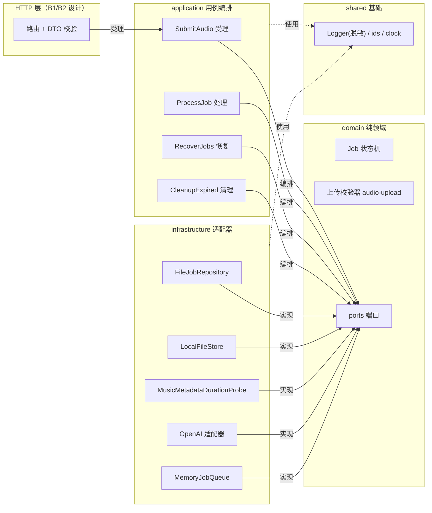
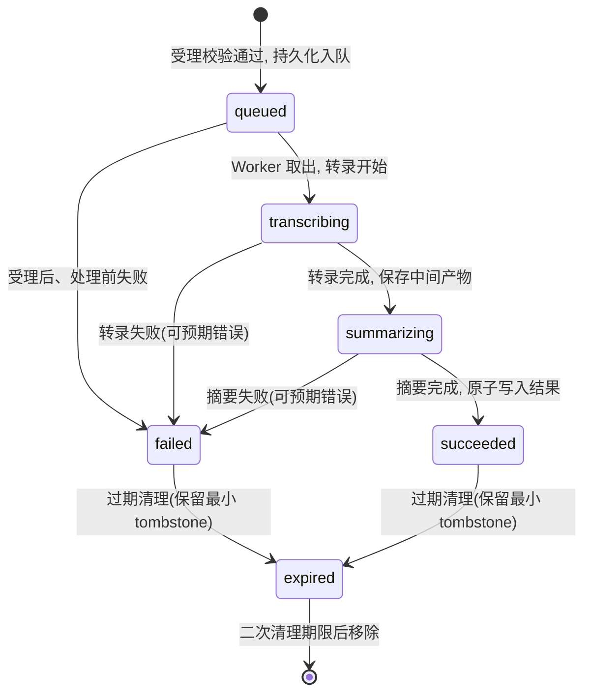
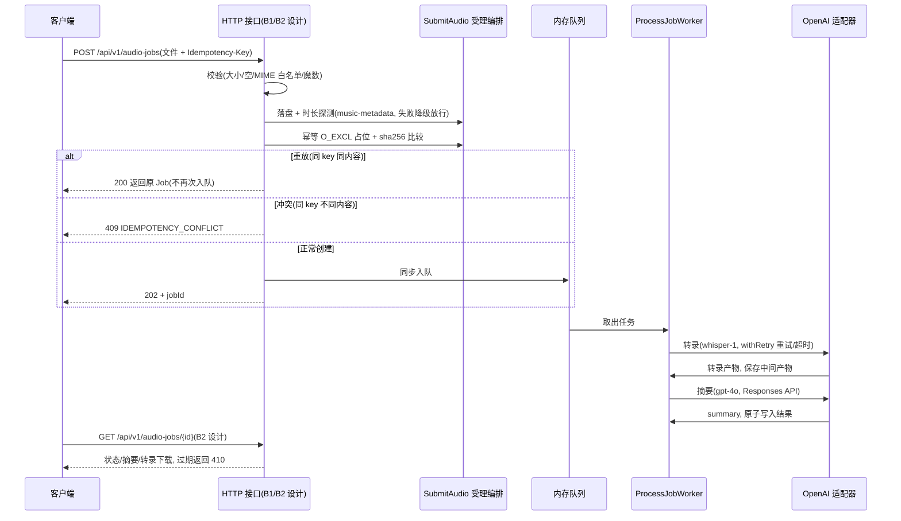

# 核心技术说明与答辩材料

> 日期：2026-08-21 ｜ 适用：项目答辩 ｜ 证据索引见 §9 ｜ 配套：docs/architecture/architecture-design.md、docs/adr/ADR-0001~0004

> **实现状态**：任务完成状态以任务清单（[docs/project-division/task-list.md](../project-division/task-list.md)）为唯一权威，本文档不重复维护状态快照。正文未加标注的机制为已实现（截至 B3 完成：端口与 OpenAI 适配器、任务用例与状态机、重试/超时、上传校验与文件安全、过期清理/tombstone、日志脱敏）；标注 **（设计）** 的 HTTP 层行为（§1 闭环、§2 `503`、§5 响应码、§7 限流、§8 错误边界）为 B 系列接口落地后的目标形态，按架构文档 §5 语义描述。

## 1. 项目概览

本项目是一个学习研究型的多模态博客助手服务：用户上传音频后获得任务标识，服务在后台完成转录（whisper-1）与摘要（gpt-4o，Responses API）并保存产物，用户可查询任务状态、查看摘要并下载转录文本，形成"音频上传 → 异步转录 → 摘要 → 结果查询"的完整闭环（架构文档 §1.1；闭环为 B 系列 HTTP 接口落地后的目标形态，**（设计）**）。项目跟随《零基础自学AI应用开发》（李光毅）第 3、4 章示例工程（音频转录、文本摘要、天气工具调用、Express 服务）逐步演进，并在此基础上按工程标准重构为可维护、可测试、可观测的 HTTP 服务，天气能力作为独立外部工具供助手调用。

## 2. 技术选型

- **语言与运行时**：TypeScript + ESM，Node 24；测试框架 vitest + tsx，覆盖率门禁 80%。
- **AI 接入**：openai SDK v7，全部对话/工具调用交互统一走 Responses API（`responses.create`）；转录与摘要能力分别经 `Transcriber`/`Summarizer` 端口（适配器）隔离，模型名经配置注入，领域层不依赖 SDK。
- **存储与队列**：`JobRepository` 文件仓储（`temp/jobs/<jobId>.json` 原子写入，先写临时文件再 rename）+ 内存有界队列（`MAX_QUEUE_LENGTH` 默认 100，满则 `503 QUEUE_FULL`——`503` 响应映射属 B 系列设计，尚未实现）；不上数据库、不做分布式。
- **多平台扩展**：未来接入 GLM 等其他 AI 平台时，通过 `Transcriber`/`Summarizer` 端口与模型名配置隔离，不引入新耦合（架构文档 §7.1）。

**分层组件**：

## 3. Responses API 迁移专题（核心）

### 3.1 背景与弃用时间线

教材第 4 章的 5 个示例（01-01/01-02/02-01/03-03/03-04）均基于 Assistants API（threads/runs）实现。该 API 已被官方弃用，并于 2026-08-26 正式关闭；同时本项目使用的 API 中转站 openai-hk 仅提供 Responses API 兼容端点（ADR-0001）。也就是说，迁移不是可选项：继续使用 Assistants API 意味着示例与重构代码在关闭日期后直接不可用。

### 3.2 迁移原因

- **官方弃用且有明确关闭日期**：Assistants API 不再可持续使用，备选方案"继续使用 Assistants API"被直接否决。
- **工具调用循环差异**：Responses API 的调用模型更简洁，一轮 `responses.create` 即可完成多工具调用，配合 `previous_response_id` 保持长上下文一致性，无需自行拼接消息历史。
- **备选方案对比**：Chat Completions API 虽支持工具调用，但无状态管理，需自行拼消息历史，5 个示例全部重写的工作量大于现有方案且不提供额外价值，被否决（ADR-0001）。迁移到 Responses API 是工作量与长期可用性之间的最优解。

### 3.3 影响范围

- 教材第 4 章 5 个 Assistants 示例（01-01/01-02/02-01/03-03/03-04）全部重写为 Responses API 并实测跑通；重构主线统一走 `responses.create`。
- SDK 差异由适配层（`infrastructure/openai/`）集中收口，领域层不受影响；"不在领域层直接依赖 OpenAI SDK 类型"列为不可做事项（ADR-0001）。
- 决策以 ADR-0001 固化，并设定触发复审条件：OpenAI 或中转站新增/变更对话 API 形态且影响工具调用或流式语义时重新评估。

### 3.4 细节对照

| 维度 | 迁移前（Assistants API，已弃用） | 迁移后（Responses API） |
| --- | --- | --- |
| 会话模型 | threads/runs 资源管理会话与运行 | `responses.create`，以 `previous_response_id` 链式携带上下文 |
| 工具结果回传 | `tool_outputs` 参数与 `role="tool"` 消息 | 第二轮调用在 `input` 中追加 `{"type": "function_call_output", "call_id", "output"}` |
| Node 流式输出 | — | `client.responses.stream(...)` + `response.output_text.delta` 事件 + `finalResponse()` |

工具调用循环固定为两轮：第一轮 `responses.create` 返回 `function_call` → 本地执行工具 → 第二轮 `responses.create` 携带 `previous_response_id`，在 `input` 中追加 `function_call_output`。迁移后"不使用已失效的 `tool_outputs` 参数与 `role="tool"` 消息"成为不可做事项（ADR-0001）。

## 4. 异步任务架构

任务状态机是核心领域模型（`Job`），唯一处理单元，状态迁移只能由 `ProcessJob` 用例完成，且每次迁移写结构化日志：

| 迁移 | 触发 |
| --- | --- |
| `queued → transcribing` | Worker 取出任务，转录开始 |
| `transcribing → summarizing` | 转录完成并保存中间产物 |
| `summarizing → succeeded` | 摘要完成，原子写入结果 |
| 任一进行中 → `failed` | 可预期错误（保留安全错误码）；未知错误由顶层错误边界记录 |
| 终态 → `expired` | 过期清理后（保留最小 tombstone，见 §5） |

上传接口只负责受理（**（设计）**，B1）：校验通过后创建 `queued` Job 并原子持久化，入队后立即返回 `202`，客户端轮询查询接口获取结果（ADR-0004）。内存队列为有界 FIFO，容量检查、Job 持久化、入队在同一同步临界区内完成。启动时执行任务恢复：`queued` 任务重新入队；`transcribing/summarizing` 进行中任务标记为 `failed: PROCESS_INTERRUPTED` 且**不自动重试**——避免不确定的重复转录计费，也不假装成功。恢复与 Worker 存在启动顺序契约：`RecoverJobs.run()` 必须先于 `ProcessJobWorker.start()` 执行，否则先启动的 worker 会消费恢复重入队的任务并迁移到进行中，随后被恢复阶段误标 `PROCESS_INTERRUPTED`。任务的最终真相始终是仓储记录（`temp/jobs/<jobId>.json`），不是日志或文件是否存在；进程收到 SIGTERM/SIGINT 时优雅关闭（服务组装属 B 系列，**（设计）**），未完成任务交给下次启动的恢复逻辑。

**状态机**（合法迁移表见 `src/domain/job.ts`）：

**时序**（上半为 B1/B2 目标形态 **（设计）**，下半为已实现的处理链路）：

## 5. 幂等与文件安全

> 本节分两层：机制层已实现（B3：白名单 MIME/魔数/时长校验、存储名由服务生成；A3：幂等互斥与过期清理/tombstone）；HTTP 响应映射（`200/409/410` 等）为 B1/B2 **（设计）**。

**与教材 03-02 的上传链路对照**（教材原版 `book-examples/chapter-04/03-02-expressjs-upload/index.js`）：

| 维度 | 教材 03-02（原版） | 重构主线（B1/B2 项为 **（设计）**） |
| --- | --- | --- |
| MIME 校验 | `startsWith('audio/')` 前缀匹配，任意 `audio/*` 伪造 MIME 可通过 | 白名单精确 4 种（`audio/mpeg/wav/mp4/x-m4a`），另加魔数一致性（mp3 ID3/MPEG 同步字、wav RIFF/WAVE、mp4/m4a `ftyp`） |
| 大小限制 | 25 MB（multer `limits`） | 25 MB（可配置） |
| 时长约束 | 无 | `MAX_AUDIO_DURATION_SECONDS` 默认 3600s；music-metadata 解析，失败降级记录不误杀 |
| 存储名 | `${时间戳}-${随机}-${originalname}`，用户文件名进入路径 | `temp/uploads/<jobId>/input.<ext>`，扩展名由服务端按 MIME 推断，用户文件名仅作展示 |
| 幂等 | 无（重复提交重复处理） | `Idempotency-Key`：O_EXCL 占位 + sha256 比较；同 key 同文件重放（`200`），不同文件 `409` |
| 受理响应 | `200 OK`，无任务标识，无异步 | `202 + jobId`；队列满 `503`；失败 `413/415/400` |
| 结果查询 | 无 | `GET /audio-jobs/{id}`（`200`/`404`/`410`）、转录下载（B2 **（设计）**） |
| 过期清理 | 无（文件永久堆积） | 每小时清理 + 最小 tombstone + 二次清理（A3） |

- **幂等**：通过 `Idempotency-Key` 支持 24 小时内重复提交——同一 key 且文件 `sha256` 一致时返回原 Job（`200`，重放不再次入队）；同一 key 但文件内容不同返回 `409 IDEMPOTENCY_CONFLICT`；无 key 的请求走普通创建。互斥由仓储 `createOrGetByIdempotencyKey` 原子保证：以 `fs.open(path, 'wx')`（O_EXCL）原子创建占位文件，收到 `EEXIST` 的请求回读既有记录比较 `sha256` 后返回 `replayed` 或 `conflict`；占位创建成功但后续失败时必须清除，防止幂等键永久卡死。占位文件以 `sha256(key)` 命名，防 key 中的路径分隔符注入（ADR-0002）。
- **文件安全**：文件名仅作展示，存储名由服务随机生成（`temp/uploads/<jobId>/input.<ext>`），拒绝路径分隔符和 MIME/魔数不一致的文件（架构文档 §5）。
- **tombstone 最小化**：过期清理每小时执行，删除 `expiresAt` 已过的输入/输出文件，但保留最小 tombstone（`id`、`status: expired`、`expiresAt`），供查询返回 `410 JOB_EXPIRED`；tombstone 在二次清理期限（建议 30 天）后移除，清理幂等并记录数量。与此配套，`BlogJob.input` 为可选字段——tombstone 最小化后任务无输入（ADR-0002 实现记录）。存储边界锁定为 `JobRepository`/`FileStore` 两个端口，未来换 SQLite/对象存储只替换 `infrastructure/` 实现。

## 6. 重试与超时策略

- **可重试范围**：仅网络错误/429/5xx 重试——判定函数 `isOpenAiRetryable` 对连接错误与连接超时（`APIConnectionError`，含超时子类）以及 HTTP 429、5xx（`APIError.status`）返回可重试；4xx 参数/内容错误、用户中止及其他未知错误不重试（架构文档 §6，`infrastructure/openai/retryable.ts`）。
- **次数与退避**：最多 3 次尝试（第 1 次 + 2 次重试，由 `OPENAI_MAX_RETRIES` 默认 2 控制，0 表示不重试）；指数退避以 1000ms 为基值逐次翻倍（1s/2s），并叠加随机抖动（默认上限 100ms）。重试耗尽抛最后一次错误，不吞错、不改写错误类型。
- **避免双重叠加**：SDK 内置重试关闭（`maxRetries: 0`），重试完全由本项目 `withRetry` 统一控制，防止 SDK 重试与本项目重试叠加放大请求次数。
- **独立超时**：转录上游超时默认 600000ms（10 分钟，大文件转录耗时长，独立配置 `OPENAI_TRANSCRIBE_TIMEOUT_MS`，不与普通请求超时共用）；摘要超时默认 60000ms（`OPENAI_SUMMARY_TIMEOUT_MS`）。
- **可观测**：转录与摘要请求均携带 jobId；成功日志 `openai.transcribed`/`openai.summarized` 记录 jobId、模型、耗时（durationMs）与重试次数（retryCount）；每次重试写 `upstream.retry` 事件日志，携带 jobId 与 attempt。以状态迁移与结果文件存在性保障幂等。

## 7. 环境与已知限制

- **API 中转站**：使用 openai-hk（`OPENAI_BASE_URL=https://api.openai-hk.com/v1`），国内直连、无需代理；key 为 `hk-` 前缀，存于各项目 `.env` 的 `OPENAI_API_KEY`，严禁进入仓库、日志或 API 响应（架构文档 §1.3）。
- **模型限制（实测）**：中转站仅提供 `whisper-1` 转录与 tts，无 `gpt-4o-transcribe` 系列——因此**词级时间戳不可用**，教材 04-02-word 示例已降级为 segment 级时间戳。转录模型默认 `whisper-1`，摘要模型 `gpt-4o`（`.env.example`）。
- **计费**：中转站为积分制；上传接口按 IP 限流（默认每 IP 每分钟 10 次）防积分滥用，超出返回 `429 RATE_LIMITED`（**（设计）**，B6）。
- **其他**：教材第 3 章 05-whisper-API 示例的本地模型未安装（约 2GB 下载量，与中转站无关），作为独立可选实现留待后续评估（架构文档 §1.2 暂缓项）。

## 8. 防护与质量门禁

- **统一错误边界**：**（设计）**，B6——路由末尾配置唯一的 Express 错误中间件，所有 async handler 经统一包装器交给它；领域错误映射为 4xx，外部依赖超时/不可用映射为 502/503，未分类异常映射为 `500 INTERNAL_ERROR`。统一响应体带 `X-Request-Id`，**不向客户端返回堆栈、上游原始报错或密钥**（架构文档 §5/§8.1）。
- **日志脱敏**：已实现——日志为 JSON 一行一个事件，对文件名、文本内容、音频路径（含 `filePath` 键，实测覆盖）、Authorization、API key 等敏感字段统一脱敏为 `[redacted]`，禁止记录完整转录内容（架构文档 §8.2）。
- **质量门禁**：格式化、Lint、类型检查、测试、覆盖率阈值（先对新增/修改代码 ≥80%）、依赖漏洞扫描、secret 扫描、OpenAPI 校验全部为必过项，失败不得以 `continue-on-error` 静默放行（架构文档 §9）。
- **ADR 护栏**：任一 PR 若改变端口、公开 API、状态机、存储策略、重试语义或安全边界，必须同步更新 ADR/OpenAPI/测试，代码评审清单明确检查该项（架构文档 §11.1）。架构测试以可执行规则落地（§11.2）：`domain/**` 不得导入 express/openai/multer/fs；`application/**` 只能依赖 `domain/**` 与 `shared/**`；每个 `/api/v1` 路由必须有 OpenAPI 定义及至少一个集成测试；每个新环境变量必须进入配置 schema 与 `.env.example`。

## 9. 验收证据索引

**测试命令**（项目根目录）：

| 命令 | 用途 |
| --- | --- |
| `npm test` | 运行全部单元/集成测试（vitest） |
| `npm run typecheck` | TypeScript 类型检查 |
| `npx vitest run --coverage` | 测试 + 覆盖率报告 |

**当前实测结果（2026-08-22，B3 完成后）**：23 个测试文件、158 个测试全部通过；覆盖率 Statements 95.13%、远超 80% 门禁（Branches/Functions/Lines 均 ≥80%，以 `npm run verify` 实测为准）。

**分阶段证据**：A2（Transcriber/Summarizer 端口与 OpenAI 适配器）14 个测试；A3（音频转录与摘要任务用例）107 个测试，当时语句覆盖率 94.52%（CLAUDE.md 重构进度记录）；A4（模型调用重试/超时策略）以 `withRetry` 重试行为测试覆盖——仅网络错误/429/5xx 重试、退避序列、4xx 不重试等用例，随 2026-08-21 全量验证一并通过；B3（上传校验与临时文件策略）新增 16 个测试（校验器 8 + 时长探针 4 + 编排 4），并重写文件存储测试钉死"用户文件名不参与路径"，随 2026-08-22 全量验证（`npm run verify`）通过。

**文档**：架构设计 v1.3（[docs/architecture/architecture-design.md](../architecture/architecture-design.md)）；任务清单 v1.4（[docs/project-division/task-list.md](../project-division/task-list.md)）；决策记录 ADR-0001~0004（[docs/adr/](../adr/)，分别覆盖 Responses API 迁移、temp/ 文件任务仓储、wttr.in 天气适配、异步任务处理）。
